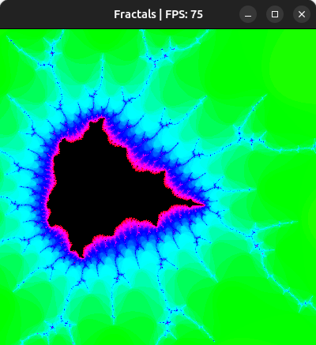
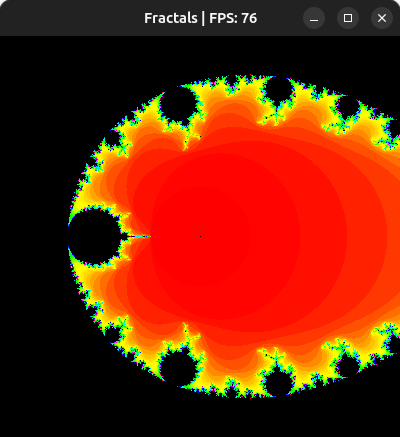

Fractals visualizator that uses OpenGL (LWJGL3) for the rendering.
Different fractals are available:
1) $z = z^2 + c$
2) $z = z^2 + {1 \over c}$
3) $z = z^2 + c^6 - 1$
4) $z = cos(z) + {1 \over c}$
5) $z = e^{z^2 + z \over \sqrt{c^3}}$
6) $z = e^{z^2 - 1.00001z \over \sqrt{c^3}}$
7) $z = e^{z^2 - 1.00001z \over c^3}$

  

To move between different fractals, use <kbd>Ctrl</kbd> + <kbd>Shift</kbd> + <kbd>Arrow left</kbd>/<kbd>Arrow right</kbd>.

To increase/decrease the fractal's resolution (the number of iterations), use <kbd>Arrow up</kbd>/<kbd>Arrow down</kbd>.

To increase/decrease the fractal's power (only for the first two fractals), use <kbd>+</kbd>/<kbd>-</kbd>.

To zoom in/out, use the <kbd>Mouse wheel</kbd>, and to move around use <kbd>Mouse left button</kbd> and move the mouse.
